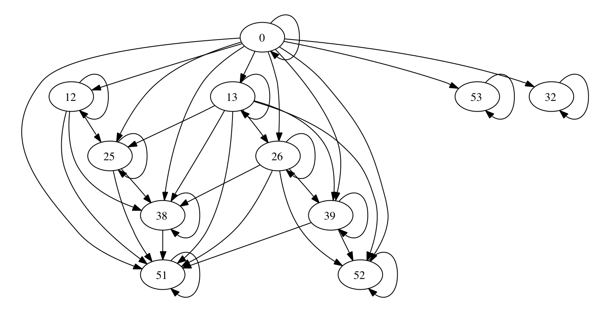

# Pequeña intro a markdown


# Listas

Podemos empezar una lista con `-` o bien `*`
```markdown
* Sin enumerar
* Y con sublistas
	* 1
	* y dos
```
Da lugar a

* Sin enumerar
* Y con sublistas
	* 1
	* y dos

Si queremos numeradas, cambiamos los `*` por un `1.`

1. numeradas
2. y también anidadas
	1. Eso, ahora otra numeración

# Fórmulas

Esto es una fórmula en línea $(x^2+1)^3$ y además podemos hacer una en

$$\int_a^b \frac{x+1}{x-1} \mathrm d x.$$

Las fórmulas en línea las escribimos con `$..$` las centradas con doble `$$` o bien `\[..\]`

# Tablas

```markdown
|Cabecera 1|Cabecera 2| Y 3|
| ----| :---: | ---: |
| Normal | Centrado | a derecha|
```

|Cabecera 1|Cabecera 2| Y 3|
| ----| :---: | ---: |
| Normal | Centrado | a derecha|


# Tipos de letra

```markdown
En *itálica*, **negrita** y en las dos **_ambos_**.
```
Que da lugar a

En *itálica*, **negrita** y en las dos **_ambos_**.


# Enlaces

Sintáxis

```markdown
[ugr](http://www.ugr.es)
```

Un enlace a la [ugr](http://www.ugr.es)
y si queremos imágenes, ponemos un ! delante
```markdown

```


# Estructura

## Subtítulo

### Otro nivel

##### Y otro

Podemos usar de una a seis \# para indicar nivel de profundidad

```markdown
# Título
## Subtítulo
...
```

# Citas

> Citas comienzan con \>

	Si usamos tabulador también obtenemos bloques
	Del tamaño que escribamos, como un verbatim


# Código insertado

Código en línea `printf("Hello world\n")`

O bien un trozo de código

```c
printf("Hello world\n");
return void;
```

Para el código en línea usamos acentos simples

	`printf("Hello world\n")`


Para varias líneas de código

	```c
	printf("Hello world\n");
	return void;
	```

Se puede especificar el lenguaje usado

# Creando transparencias

Para convertirlo en transparencias hacemos

```bash
pandoc -s --mathjax -t slidy resumen.md -o resumen.html
```

o localmente con

```bash
pandoc -s --mathjax=/Users/pedro/lib/MathJax/MathJax.js?config=TeX-AMS-MML_HTMLorMML
	-t slidy resumen.md -o resumen.html
```

También podemos utilizar [remark](http://remarkjs.com), de hecho
estas transparencias están hechas con `remark`([ejemplo](transparencias-remark.html){target="_blank"})

O la extensión [Marp](https://marketplace.visualstudio.com/items?itemName=marp-team.marp-vscode) de Visual Studio Code