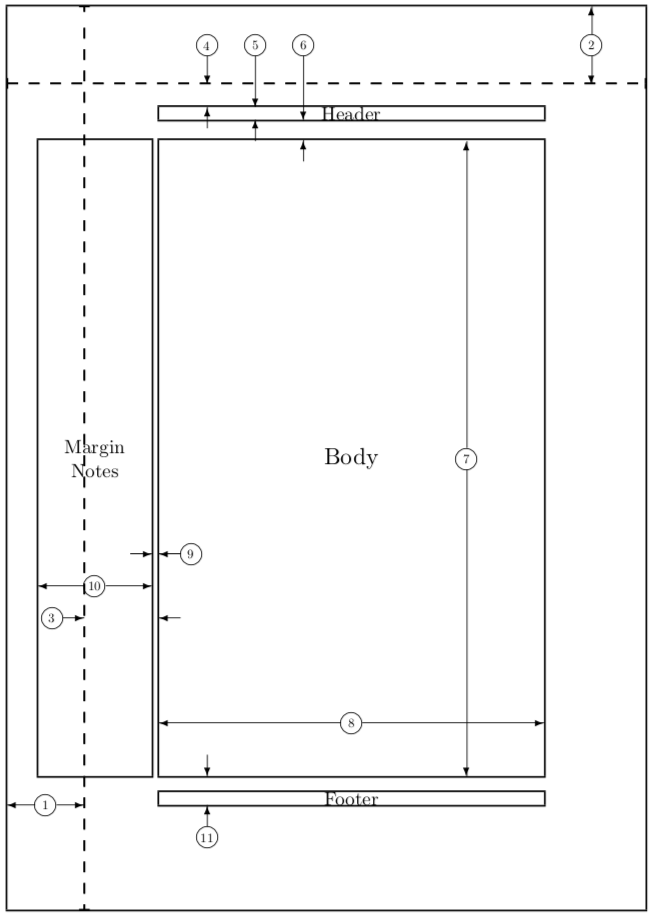
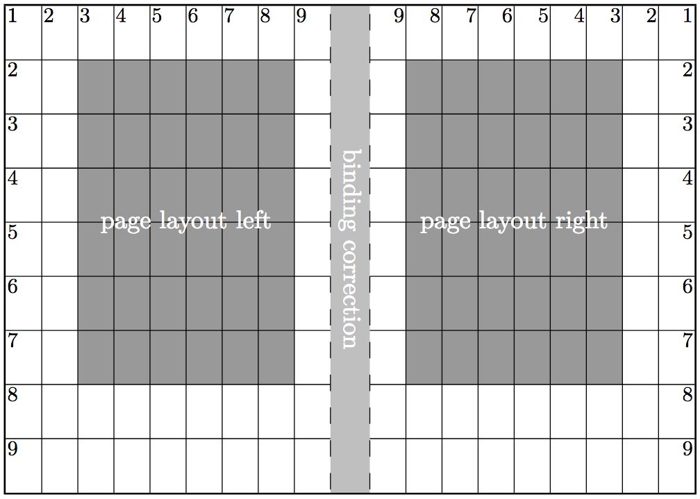

Veremos a continuación diversos modos de personalizar un documento en LaTeX para adaptarlo a nuestras necesidades. Cubriremos los siguientes aspectos:

1. Creación de comandos y entornos propios
2. Diseño de página: cambiar tamaño de página y márgenes. Los paquetes `geometry` y `typearea`
3. Diseño de cabecera y pie de página: los paquetes `fancyhdr` y `scrlayer-scrpage`
4. Personalización de capítulos y secciones: los paquetes `titlesec` y `fancychap`
5. Selección de una tipografía: [The LaTeX font Catalogue](http://www.tug.dk/FontCatalogue/). Uso de las fuentes del sistema: [XeLaTeX](http://xetex.sourceforge.net/). Fuentes de iconos con el paquete `fontawesome`.


## Creación de órdenes y entornos propios

LaTeX posee multitud de órdenes para cada una de las tareas necesarias en la edición de textos. Sin embargo, es a veces útil definir nuestras propias órdenes o entornos para agilizar la edición de un documento. 

### Nuevas órdenes: la orden `\newcommand`
Veamos en primer un ejemplo sencillo. Para escribir en matemáticas el conjunto de los números reales usamos el comando `$\mathbb{R}$`. Si estamos editando un documento y tenemos que incluir muchas veces dicho conjunto de números es más conveniente definir un comando más corto para ello. Así, si escribimos en el *preámbulo* de nuestro documento la siguiente línea:
```tex
\newcommand{\R}{\mathbb{R}}
```

entonces tendremos a nuestra disposición la nueva orden `\R` para el conjunto de los números reales.

La sintaxis para definir un comando nuevo en LaTeX es la siguiente:

```tex
\newcommand{\nuevocomando}[n]{definición}
```

donde `[n]` es un parámetro opcional que indica el número `n` de *argumentos* que va a tener el nuevo comando. Si no se especifica nada el comando creado no tendrá argumentos (como en el ejemplo anterior `\R`). En el siguiente ejemplo se crea un comando que aceptará exactamente dos parámetros

```tex
\newcommand[2]{\parcial}{\frac{\partial #1}{\partial #2}}
```

nos permite escribir `\parcial{f}{x}` e imprimirá la derivada parcial de la función `f` con respecto a la variable `x`. Observemos que los identificadores `#1` y `#2` se sustituyen en la definición del comando por el primer y segundo argumento proporcionado.

La única precaución que tenemos que tener es que el comando que estamos definiendo no puede existir, en cuyo caso LaTeX nos dará un error. Si lo que queremos es realmente cambiar un comando ya existente deberemos usar la orden `\renewcommand` cuya sintaxis es idéntica a `\newcommand`.

### Entornos: la orden `\newenvironment`

Para definir un entorno nuevo usaremos la orden `\newenvironment` cuya sintaxis es la siguiente:

```tex
\newenvironment{nombre}[n]{inicio}{fin}
```

donde `[n]` es un parámetro opcional que indica el número `n` de argumentos que va a aceptar el entorno. Una vez definido lo usaremos de la forma habitual:

```tex
\begin{nombre}
Texto
\end{nombre}
```

Al igual que ocurría con la definición de un comando, la única precaución que tenemos que tener es que el entorno que estamos definiendo no puede existir, en cuyo caso LaTeX nos dará un error. Si lo que queremos es realmente cambiar un entorno ya existente deberemos usar la orden `\renewenvironment` cuya sintaxis es idéntica a `\newenvironment`.

TODO: hablar del espacio en los entornos con \ignorespace (ver lshort).

En el archivo [`comandosyentornos.tex`](comandosyentornos.tex) podemos ver varios ejemplos diferentes del uso de estos dos tipos de órdenes.

## Diseño de página

Al inicio de cualquier documento en LaTeX se ha de indicar el tipo (o la clase) del mismo mediante la orden `\documentclass` (ver la sección [Tipos de documento](../Tipos de documento/about.qmd) para más información). Cada tipo de documento define sus propios márgenes (superior, inferior y laterales), suele reservar un área para las notas al margen y suele fijar, normalmente mediante una opción indicada en el comando `\documentclass`, el tamaño de papel en el que se imprimirá el documento. En la siguiente imagen podemos ver dibujadas las diferentes secciones en las que es dividida una página 



Para mostrar dicho esquema basta cargar el paquete `showframe`. LaTeX permite cambiar las medidas de cada uno de dichos elementos pero no es aconsejable aventurarse a ello salvo que sepamos algo sobre las reglas de maquetación de página.

Para personalizar nuestro documento, en lugar de cambiar manualmente la anchura de los márgenes, texto, altura de la cabecera, etc, cargaremos un paquete específico para ello. Los dos paquetes más habituales son los siguientes:

- [`geometry`](https://www.ctan.org/pkg/geometry): permite modificar los márgenes de un documento de forma muy sencilla. Por ejemplo, supongamos que tenemos que crear un documento con las siguientes especificaciones: *el tamaño del papel será un a4. El texto debe tener 16.5cm de anchura por 22cm de altura. El margen superior debe ser de 3cm y el margen izquierdo 2.3cm. El pie de página debe situarse bajo el área reservada para el texto*. Para conseguir dicho documento basta escribir:

```tex
\documentclass[a4paper]{article}
\usepackage[total={16.5cm, 22cm},
            top=3cm, left=2.3cm, includefoot]{geometry}
```

donde por supuesto podemos cambiar `article` por la clase de documento que deseemos. Esto le da al usuario mucho control sobre el diseño de página, pero también mucha responsabilidad pues deberá saber elegir bien los valores para que el diseño de página sea armonioso.

- `typearea`: El paquete `typearea` aborda el problema de forma distinta: le proporciona al usuario diversos moddos de ajustar el diseño y algoritmos basados en prácticas tipográficas estándar se encargan de recalcular los elementos de la página de forma correcta. En la sección 2.1 del manual de KOMA-Script (página 29) se encuentra una descripción más detallada de cómo funciona este proceso.

### El paquete `typearea`

Para usar correctamente este paquete hay que entender los factores que afectan al diseño de una página:
- el tamaño, anchura y tipo de la fuente usada.
- el espacio entre líneas
- la longitud de las palabras
- el espacio disponible
El primero de estos factores nos indica que la elección de la fuente que se usará en el documento es determinante a la hora de diseñar la página. Por dicho motivo el paquete `typearea` se cargará después de haber seleccionado la fuente del documento y modificado (si se cree conveniente) la separación entre líneas (p.e. con el paquete `setspace`). Dicho paquete tiene dos opciones importantes:
- `BCOR` (*Binding corrections*): corrección al encuadernado. Longitud (generalmente en mm) que corresponde a la anchura del lomo del libro que será necesaria para el encolado o cosido en el proceso de encuadernación.
- `DIV` (*divisions*): número natural que indica el número de columnas en las que internamente se dividirá la página para ayudar a la hora de situar todos los elementos. Cuando mayo sea dicho número generalmente aumentará el ancho del texto. 



Por ejemplo:

```tex
\usepackage{bookman}
\linespread{1.25}
\usepackage[BCOR=5mm, DIV=9]{typearea}   
```

Además `DIV` permite también varios valores especiales (ver tabla 2.3 en el manual de KOMA-Script):
- `default`: recalcula el diseño de página con los parámetros por defecto.
- `classic`: recalcula el diseño de página usando el canon de diseño medieval.
- `calc`: recalcula el diseño de página. Útil para usarlo tras cambiar el tamaño de la fuente o el espaciado de líneas.
- `last`: recalcula el diseño de página usando la opción DIV que se usó la última vez. Útil si estamos usando el paquete `typearea` junto con una clase del paquete KOMA-Script (ver ejemplo más abajo)

Si usamos una clase del paquete KOMA-Script no es necessario cargar el paquete `typearea` puesto que la clase de documento se encargará de ello. De hecho las opciones `DIV` y `BCOR` deberemos indicarlas en el bloque `\KOMAoptions{}`. Puesto que la elección de fuente se suele hacer a posteriori deberemos indicarle al paquete `typearea` que *recalcule* el diseño de página usando la opción `last`. Un ejemplo concreto sería el siguiente:

```tex
\documentclass{scrartcl}

\KOMAoptions{
  fontsize=10pt 
  ,DIV=9
}
\usepackage{bookman}
\linespread{1.25}
\usepackage[BCOR=5mm, DIV=classic]{typearea}   % <factor>, calc, classic
\KOMAoptions{DIV=last} % Alternativamente usar \recalctypearea
```

#### Márgenes amplios con el paquete `typearea`

Una situación interesante es diseñar una página con espacio para notas al margen (que podemos incluir con el comando `\marginpar` aunque es mejor usar el paquete `sidenote`). Para ello debemos *ampliar* la anchura de dicha sección de la página. Para ello usaremos, por ejemplo,

```tex
\setlength{\marginparwidth}{2\marginparwidth}
```

para duplicar la anchura de dicha área (podemos especificar en el segundo argumento cualquier longitud absoluta que queremos, p.e. 3cm)

Esto deberemos hacerlo tras *recalcular* el diseño de página pues de lo contrario no será efectivo. Además, para que el cambio sea coherente con el diseño de página deberemos indicar la opción `mpinclude` en `KOMAoptions` para que el paquete `typearea` considere al margen como parte del texto (ya que vamos a usarlo para tal fin incluyendo notas al margen). Un ejemplo completo sería el siguiente:

```tex
\documentclass{scrartcl}

\KOMAoptions{
  fontsize=10pt 
  ,mpinclude
  ,DIV=9
}
\usepackage{bookman}
\linespread{1.25}
\usepackage[BCOR=5mm, DIV=classic]{typearea}   % <factor>, calc, classic
\KOMAoptions{DIV=last} % Alternativamente usar \recalctypearea
\setlength{\marginparwidth}{2\marginparwidth}
```

### Personalización de los elementos de página en las clases del paquete KOMA-Script

Cada uno de los elementos de un documento: título, nombre del autor, secciones y capítulos, fecha, dedicatoria, citas, pies de página,... tienen un tamaño, tipo de fuente, estilo y color predefinido pero pueden cambiarse a voluntad. Para ello las clases del paquete KOMA-Script proporcionan dos comandos `\setkomafont` y `\addtokomafont` que permiten cambiar dicho estilo. En la [documentación del paquete](http://www.texdoc.net/texmf-dist/doc/latex/koma-script/scrguien.pdf) (ver pp. 60--63) podemos encontrar una lista completa de todos los elementos susceptibles de ser cambiados. Destacaremos aquí los más habituales:

- `disposition` todos las secciones de estructura del docuemnto: desde `\part` hasta `\minisec` incluyendo el título del entorno `abstract`
- `title` formato para el título (comando `\title`)
- `author` formato para el nombre del autor (comando `\author`) 
- `titlehead` formato para la cabecera sobre el título (comando `\titlehead`)
- `subject` formato para el tema del documento (comando `\subject`)
- `date` formato para la fecha (comando `\date`)
- `part` formato para las partes del documento (comando `\part`)
- `chapter` formato para los capítulos (comando `\chapter`)
- `chapterprefix` formato para el texto "Capítulo" que suele anteponerse al nombre del capítulo 
- `section` formato para las secciones (comando `\section`)
- `subsection` formato para las subseciones (comando `\subsection`)
- `minisec` formato para las *minisecciones* (comando `\minisec`)
- `dictum` formato para las citas (comando `\dictum`)
- `caption` formato para el título de una figura o tabla (comando `\caption`) 
- `captionlabel` formato para la etiqueta del título de una figura o tabla (comando `\caption`) 
- `footnote` formato para las notas al pie de página (comando `\footnote`) 
- `pagennumber` formato para los números de página (comando `\footnote`) 

El uso de los comandos `\setkomafont` y `\addtokomafont` es el siguiente:

```tex
\setkomafont{elemento}{valor}
```
donde *elemento* es uno de la lista anterior y *valor* es el estilo que queremos aplicar. Entre los valores más habituales están los siguientes:

- `\rmfamily` (roman font), `\sffamily` (sans-serif font), `\ttfamily` (monospace font) para el tipo de letra. 
- `\upshape` (recta), `\itshape` (itálica), `\slshape` (inclinada), `\scshape` (versalitas) para el estilo 
- `\mdseries` (normal), `\bfseries` (negrita), para el grosor y
- `\Huge`, `\huge`, `\LARGE`, `\Large`, `\large`, `\normalsize`, `\small`, `\footnotesize`, `\scriptsize`, `\tiny` para el tamaño.

Además, al redefinir un estilo podemos usar como *valor*`\usefontofkomafont{elemento}` o bien `\usesizeofkomafont{elemento}` y copiaremos la tipografía o el tamaño del elemento deseado.
